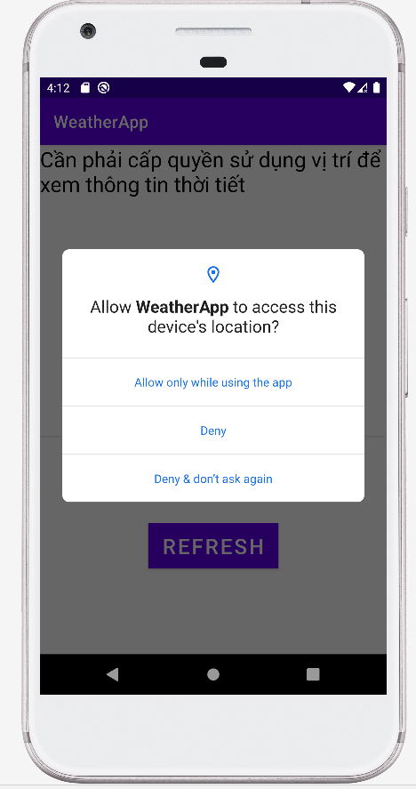
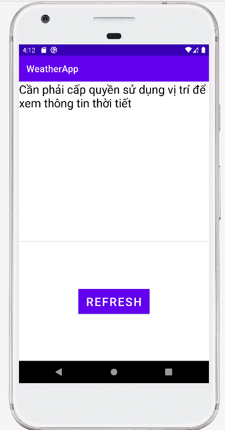
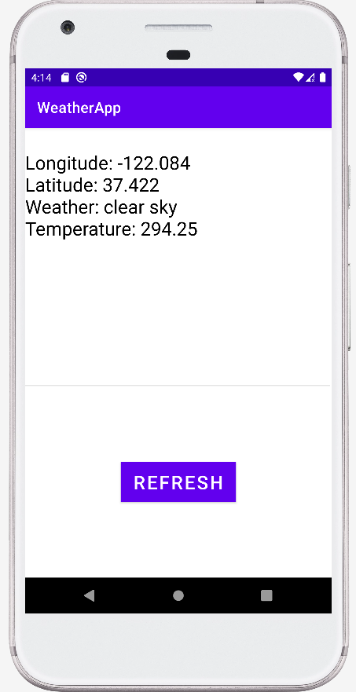

# Tổng quan

Đây là app xem thông tin thời tiết tại đúng tọa độ hiện tại của người sử dụng thiết bị.

# Ảnh chụp màn hình

App tự động xin được cấp quyền truy cập vị trí thiết bị mỗi khi cần lấy tọa độ để gọi API thời tiết từ openweathermap.

Nếu không cấp quyền truy cập vị trí, nội dung hiển thị trong app sẽ là câu "Cần phải cấp quyền sử dụng vị trí để xem thông tin thời tiết".

Thông tin hiển thị gồm có tọa độ, tình hình thời tiết, nhiệt độ (độ F). Hàm lấy thông tin này được gọi khi khởi động app hoặc ấn vào button REFRESH. Trong thời gian chờ API gửi phản hồi về, nội dung hiển thị sẽ là "LOADING".

Hiện tại, hoàn toàn có thể vừa chờ đợi API trả về dữ liệu, vừa làm các công việc khác mà không sợ đơ máy do đã được giải quyết bằng các sinh Thread đợi API respone.

Ngoài ra tại một thời điểm bất kì, chỉ có một tiến trình lấy dữ liệu thời tiết được hoạt động.

